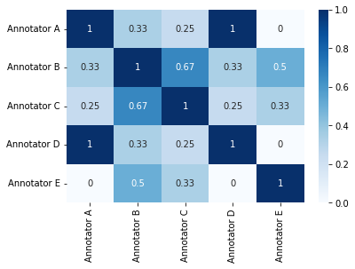

# Scoring and metrics app



## Description

This app improves the efficiency of annotating data by improving annotation quality while reducing the time required to
produce them.

The components of this app are:

1. Functions to calculate scores for quality tasks and model predictions.
2. Custom nodes that can be added to pipelines to calculate scores when a task's quality items are completed.

## Install App in a Project

When the dpk is published, a DPK ID is generated. This ID is used to install the app into a project.

```
dlp app install --dpk-id <DPK ID> --project-name <PROJECT_NAME>
```

Alternatively, in Python the app can be installed with DPK:

```python 
project.apps.install(dpk=dpk)
```

## Tutorial and How-To

* Scores for a quality task will be automatically calculated when this app is installed.

## Functions

* `calculate_task_score`
    * Description: This function takes calculates scores for the relevant items contained within the task.
    * Input:
        * `task`: the relevant task entity
        * `score_types`: optional list for specifying which scores are to be calculated
    * Output:
        * `task`: the original task entity

* `calculate_task_item_score`
    * Description: This function takes items from a consensus task and calculates annotations scores for a given item,
      including the overall annotation score and overall item score.
    * Input:
        * `item`: item whose annotations are to be scored
        * `task`: optional task entity for the task that the item belongs to
        * `context`: optional context dictionary for the relevant IDs associated with the item
        * `score_types`: optional list for specifying which scores are to be calculated
    * Output:
        * `item`

* `create_model_score`
    * Description: This function takes model predictions (i.e. annotations) and calculates the score for each
      prediction.
    * Input:
        * `dataset`: the dataset entity containing the model predictions
        * `model`: the model entity that produced the predictions
        * `filters`: optional DQL filter for selecting the relevant dataset items
        * `ignore_labels`: optional boolean for whether to ignore the labels in the model predictions
        * `match_threshold`: optional float for IOU threshold for matching model predictions to ground truth annotations
        * `compare_types`: optional list for specifying which annotation types are to be compared

* `calculate_annotation_scores`
    * Description: This function takes annotations and calculates the score for each annotation.
    * Input:
        * `annot_collection_1`: set 1 of a dl.AnnotationCollection or list of annotations 
        * `annot_collection_2`: set 2 of a dl.AnnotationCollection or list of annotations
        * `ignore_labels`: optional boolean for whether to ignore the labels in the model predictions
        * `match_threshold`: optional float for IOU threshold for matching model predictions to ground truth annotations
        * `compare_types`: optional list for specifying which annotation types are to be compared
        * `score_types`: optional list for specifying which scores are to be calculated

* `get_model_scores_df`
    * Description: This function generates the pandas dataframe of model scores.
    * Input:
        * `dataset`: the dataset entity containing the test items that were predicted on
        * `model`: the model entity that produced the predictions
    * Output:
        * `model_scores_df`: pandas dataframe containing the scores

## Contributions, Bugs and Issues - How to Contribute

We welcome anyone to help us improve this app.  
[Here](CONTRIBUTING.md) are detailed instructions to help you open a bug or ask for a feature request
